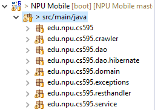
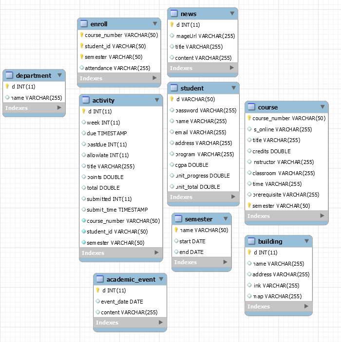

# NPU Mobile (Server)

NPU Mobile is the first Android application for Northwestern Polytechnic University students.

## Introduction

NPU Mobile Server provides back-end support to NPU Mobile app. It crawls data from [NPU Website](http://www.npu.edu), stores to MySQL database hosted on Amazon Relational Database Service (RDS), syncs automatically and provides RESTful APIs to [NPU Mobile Android application](https://github.com/wynnsu/hamster).

## Architecture

## Database

### Database Configuration

[`src/main/resources/database.xml`](src/main/resources/database.xml)

Define database related beans, including `dataSource`, `sessionFactory` and `trasactionManager`.

### Create database schema and tables

[`src/main/resources/CreateDb.sql`](src/main/resources/CreateDb.sql)

### Add mock data

[`src/main/resources/AddDataDb.sql`](src/main/resources/AddDataDb.sql)

*NPU Mobile Server uses mock data for Student Protal related functions for security consideration.*

## APIs

Method|Url|Description
------|---|-----------
GET|/event/{id}|Get academic events by id
GET|/event|Get all academic events
GET|/building/{id}|Get building by id
GET|/building|Get all buildings
GET|/news/{id}|Get news by id
GET|/news|Get all news
GET|/course/{id}|Get course by id
GET|/course|Get all courses
GET|/course/{id}/prerequisite|Get prerequisite for specific course
GET|/student/{id}|Get student information
GET|/student/{id}/activity|Get student activities
GET|/student/{id}/activity/coming|Get upcoming student activity
GET|/student/{id}/activity/latest|Get latest grade of student
GET|/student/{id}/attendance|Get student attendance record
POST|/student/{id}|Login a student
PUT|/update|Update general information (News, Events etc.)